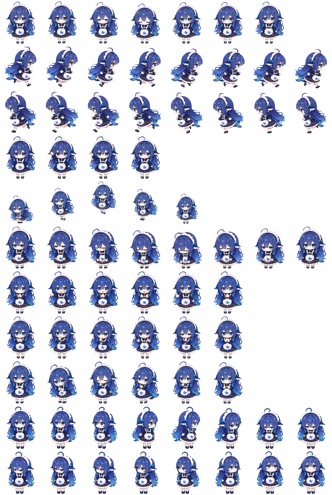

# DeepSeek 小鲸鱼 Pet（优化版）

一个适用于 Codex Desktop 的 DeepSeek 主题动态桌面宠物，采用 v2 spritesheet 格式。

> 来源说明：本项目基于 **Hermes 的 DeepSeek 小鲸鱼 pet** 进行优化与适配，感谢原始创意与基础素材。

## 预览



## 文件

- `pet.json`：宠物元数据与 spritesheet 配置
- `spritesheet.webp`：动画精灵图

## 安装

将 `pet.json` 和 `spritesheet.webp` 放入 Codex pet 目录：

```text
~/.codex/pets/deepseek/
```

最终目录结构：

```text
~/.codex/pets/deepseek/
├── pet.json
└── spritesheet.webp
```

重启 Codex Desktop 后选择该 pet 即可。

## 致谢

- 原始基础：Hermes 的 DeepSeek 小鲸鱼 pet
- 优化与 Codex 适配：[@f17tm22](https://github.com/f17tm22)

本仓库未额外声明素材许可证；使用与再分发时请同时遵循原始素材的授权要求。
